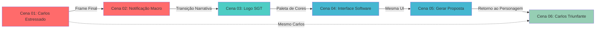

# 🎬 Guia de Continuidade Entre Cenas - SGT Pro Propostas

## ✅ Modificações Realizadas

Todos os **6 arquivos JSON** foram atualizados com **campos de continuidade** para garantir que o Carlos e os elementos visuais se mantenham consistentes ao longo do vídeo.

---

## 📋 Novo Formato dos JSONs

Cada cena agora inclui os seguintes campos adicionais:

### 🔹 Campos Principais de Continuidade

```json
{
  "scene_number": "01",
  "continuity_type": "TIPO DE CONTINUIDADE",
  "reference_frame": "Instrução sobre frame de referência",
  "transition_note": "Como esta cena conecta com a anterior",
  "description": "MARCADORES DE CONTINUIDADE + descrição completa...",
  "character_consistency": {
    "name": "Carlos",
    "age": 45,
    "ethnicity": "Brazilian mixed race (white/pardo complexion)",
    "clothing": "casual business attire - dark blue sport blazer, brown trousers, light beige shirt",
    ...
  }
}
```

---

## 🎯 Como Usar no Veo 3.1

### **Workflow Recomendado:**

#### 1️⃣ **Cena 01 (Baseline)**
- ✅ Gere o vídeo usando `cod-cena01-carlos.json`
- ✅ **Exporte o frame final** (aos 8 segundos) como imagem
- ✅ Salve como: `frame_final_cena01.png`

#### 2️⃣ **Cena 02 (Com Referência)**
- ✅ **IMPORTANTE**: Use `frame_final_cena01.png` como **imagem de referência** no Veo
- ✅ O JSON já indica: `"reference_frame": "Use final frame from Scene 01 as visual reference"`
- ✅ Isso garante que o Carlos, o escritório e a iluminação sejam consistentes

#### 3️⃣ **Cena 03 (Transição Narrativa)**
- ✅ Esta é uma cena de **logo/branding** (abstrata)
- ✅ Não precisa de frame de referência de Carlos
- ✅ Serve como "quebra visual" entre problema e solução

#### 4️⃣ **Cenas 04-05 (Interface de Software)**
- ✅ Mantenha consistência visual da **interface do SGT**
- ✅ Mesma paleta de cores (azul e branco)
- ✅ Use o frame final da Cena 04 como referência para Cena 05

#### 5️⃣ **Cena 06 (Retorno ao Carlos)**
- ✅ **CRÍTICO**: Use a **mesma referência visual do Carlos da Cena 01**
- ✅ O JSON já marca: `"SAME CARLOS FROM SCENE 01 - NOW TRANSFORMED"`
- ✅ Mantenha rosto, roupa e características **idênticas**
- ✅ Apenas a **expressão emocional** muda (de estressado para confiante)

---

## 📊 Mapa de Continuidade Visual



---

## 🔑 Campos-Chave Por Cena

### **Cena 01 - Baseline do Carlos**
```json
"character_consistency": {
  "name": "Carlos",
  "age": 45,
  "ethnicity": "Brazilian mixed race (white/pardo complexion)",
  "clothing": "casual business attire - dark blue sport blazer, brown trousers, light beige shirt",
  "location": "technical office with surveying equipment",
  "lighting_reference": "cold natural daylight 6500k"
}
```

### **Cena 02 - Manter Carlos + Ambiente**
```json
"character_consistency": {
  "name": "Carlos",
  "visible_elements": "hands with same skin tone",
  "location": "same technical office and desk from Scene 01",
  "lighting_reference": "same cold natural daylight 6500k",
  "same_device": "Lenovo ThinkPad T480 from Scene 01"
}
```

### **Cena 06 - Carlos Transformado**
```json
"character_consistency": {
  "name": "Carlos - SAME CHARACTER FROM SCENE 01",
  "clothing": "SAME casual business attire from Scene 01",
  "physical_features": "SAME mature adult male - maintain exact facial features",
  "location": "SAME technical office from Scene 01, different angle",
  "emotional_transformation": "FROM stressed → TO confident"
}
```

---

## ⚠️ Checklist Antes de Gerar Cada Cena

### Cena 01:
- [ ] Sem preparação prévia necessária
- [ ] **Exportar frame final aos 8s**

### Cena 02:
- [ ] **Carregar `frame_final_cena01.png` como referência no Veo**
- [ ] Verificar se mantém o mesmo notebook e escritório

### Cena 03:
- [ ] Sem referência de frame (cena abstrata)
- [ ] Focar em branding premium

### Cena 04:
- [ ] Verificar paleta azul/branco da interface
- [ ] **Exportar frame final da interface**

### Cena 05:
- [ ] **Carregar frame final da Cena 04** para manter UI consistente
- [ ] Checar se mantém mesma interface

### Cena 06:
- [ ] **CRÍTICO**: Carregar `frame_final_cena01.png` para manter o MESMO Carlos
- [ ] Verificar se roupa, rosto e características são idênticas
- [ ] Apenas expressão deve mudar (confiante vs estressado)

---

## 🎥 Benefícios da Nova Estrutura

### ✅ Consistência Visual
- Carlos mantém **mesma aparência** da Cena 01 até a Cena 06
- Escritório e iluminação **consistentes**
- Interface de software **coesa**

### ✅ Arco Narrativo Claro
- **Problema** (Cenas 01-02): Carlos estressado
- **Solução** (Cenas 03-05): SGT Pro Propostas
- **Resultado** (Cena 06): Carlos bem-sucedido

### ✅ Transições Suaves
- Cada cena sabe como **conectar** com a anterior
- Campos `transition_note` guiam a narrativa
- `reference_frame` garante continuidade visual

---

## 📁 Arquivos Modificados

```
✅ cod-cena01-carlos.json - Estabelece baseline do Carlos
✅ cod-cena02-carlos.json - Mantém Carlos e ambiente
✅ cod-cena03-carlos.json - Transição narrativa (logo)
✅ cod-cena04-carlos.json - Demonstração de software
✅ cod-cena05-carlos.json - Continuação da interface
✅ cod-cena06-carlos.json - Retorno ao Carlos transformado
```

---

## 💡 Dica Pro

Se o Veo 3.1 permitir, você pode criar uma **"Character Reference Sheet"** única do Carlos na Cena 01 e usar essa referência em **todas as cenas** onde ele aparece (01, 02 e 06), garantindo 100% de consistência facial.

---

## 🚀 Próximos Passos

1. Gerar Cena 01 → **Exportar frame final**
2. Usar frame da Cena 01 para gerar Cena 02
3. Gerar Cenas 03-05 (sem Carlos)
4. **Reutilizar frame da Cena 01** para gerar Cena 06
5. Editar todas as 6 cenas em sequência

---

**Pronto para produção! 🎬✨**
