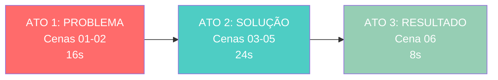

# 🎬 Storyboard Visual - SGT Pro Propostas

## 📊 Visão Geral do Vídeo

**Duração Total**: 48 segundos (6 cenas × 8s)  
**Formato**: 16:9 widescreen  
**Estilo**: Documentário corporativo cinematográfico  
**Arco Narrativo**: Problema → Solução → Sucesso

---

## 🎭 Estrutura Narrativa em 3 Atos



---

## 🎞️ Cenas Detalhadas

### **Cena 01 - O Desafio Analógico** (00:00 - 00:08)


#### 📝 Descrição Visual
- **Enquadramento**: Over-the-shoulder transitioning para medium shot
- **Personagem**: Carlos (45 anos, brasileiro, blazer azul escuro)
- **Ambiente**: Escritório técnico com equipamento de topografia
- **Iluminação**: Luz natural fria (6500k) + brilho quente da tela (4000k)
- **Estado Emocional**: Concentrado, levemente estressado

#### 🎤 Narração
> "Este é o Carlos. Um mestre no campo, mas o escritório ainda é um desafio."

#### 🎯 Objetivo da Cena
Estabelecer o **problema**: métodos analógicos são trabalhosos e lentos

#### ✅ Continuidade
- **Baseline do personagem** - Esta cena define características visuais de Carlos
- **Frame final desta cena** será usado como referência para Cena 02

---

### **Cena 02 - A Pressão do Mercado** (00:08 - 00:16)


#### 📝 Descrição Visual
- **Enquadramento**: Extreme macro, shallow depth of field
- **Foco**: Notificação digital em português + mãos desfocadas
- **Iluminação**: Brilho azul da notificação refletindo nas superfícies
- **Estado Emocional**: Pressão, urgência de deadline

#### 🎤 Narração
> "Métodos tradicionais exigem muito tempo. No mercado, agilidade também é precisão."

#### 🎯 Objetivo da Cena
Intensificar o **problema**: pressão do mercado e urgência

#### ✅ Continuidade
- **Usa frame final da Cena 01** como referência visual
- **Mesmo ambiente**, mesma iluminação, mesmo laptop
- **Mãos do Carlos** mantêm tom de pele consistente

---

### **Cena 03 - A Identidade SGT** (00:16 - 00:24)


#### 📝 Descrição Visual
- **Enquadramento**: Push-in cinematográfico no logo 3D
- **Ambiente**: Espaço digital minimalista (azul navy profundo)
- **Iluminação**: Volumétrica branca criando aura luminosa
- **Estilo**: Branding premium, ray-traced rendering

#### 🎤 Narração
> "SGT Pro Propostas: a lógica digital para o rigor da sua topografia."

#### 🎯 Objetivo da Cena
**Apresentar a solução**: SGT Pro Propostas como resposta ao problema

#### ✅ Continuidade
- **Transição narrativa** de problema para solução
- **Paleta azul** conecta com interface nas próximas cenas
- **Quebra visual intencional** (cena abstrata)

---

### **Cena 04 - A Prova Técnica** (00:24 - 00:32)


#### 📝 Descrição Visual
- **Enquadramento**: Screen capture estático
- **Interface**: UI azul e branco, design moderno e limpo
- **Ação**: Click no botão → campos populam automaticamente
- **Valores**: "R$ 5.400,00" / "2 Topógrafos, 1 Assistente"

#### 🎤 Narração
> "Selecione o serviço e o cálculo é automático. Simples, rápido e exato."

#### 🎯 Objetivo da Cena
**Demonstrar a solução**: cálculo automático eliminando trabalho manual

#### ✅ Continuidade
- **Paleta de cores** conecta com branding da Cena 03
- **Frame final** será referência para Cena 05 (mesma interface)

---

### **Cena 05 - O Fluxo de Entrega** (00:32 - 00:40)


#### 📝 Descrição Visual
- **Enquadramento**: Foco no botão verde "Gerar Proposta"
- **Interface**: Mesma UI da Cena 04 (continuidade)
- **Ação**: PDF gerado → WhatsApp → Confirmação de envio
- **Micro-animações**: Ícones aparecem sequencialmente

#### 🎤 Narração
> "Personalize o edital, gere o PDF e envie por WhatsApp. Tudo em segundos."

#### 🎯 Objetivo da Cena
**Completar o workflow**: da entrada de dados até entrega ao cliente

#### ✅ Continuidade
- **Usa frame da Cena 04** como referência visual
- **Mesma interface**, mesma paleta azul/branco
- **Destaque verde** do CTA se mantém consistente

---

### **Cena 06 - O Sucesso no Campo** (00:40 - 00:48)


#### 📝 Descrição Visual
- **Enquadramento**: Medium shot frontal, Carlos caminhando
- **Personagem**: **MESMO Carlos da Cena 01** (mesma roupa, mesmo rosto)
- **Ambiente**: **Mesmo escritório da Cena 01** (ângulo diferente)
- **Iluminação**: Transição de indoor (3000k) → outdoor (6000k) com lens flare
- **Estado Emocional**: Confiante, bem-sucedido, sorrindo

#### 🎤 Narração
> "Foque no campo e deixe a gestão com o SGT Pro. Feche mais contratos."

#### 🎯 Objetivo da Cena
**Mostrar a transformação**: Carlos agora livre do escritório, bem-sucedido

#### ✅ Continuidade
- **CRÍTICO**: Usa **referência visual da Cena 01** (mesmo Carlos)
- **Arco narrativo completo**: estressado (Cena 01) → confiante (Cena 06)
- **Mesmo ambiente**, mas ângulo mostrando saída/luz = liberdade

---

## 📊 Análise de Continuidade Visual

### 🔗 Mapa de Referências de Frames

```
Cena 01 (BASELINE)
   ├──> Cena 02 (usa frame final 01)
   └──> Cena 06 (usa referência de Carlos da 01)

Cena 03 (BRANDING - abstrato)
   └──> Cena 04 (paleta de cores)

Cena 04 (INTERFACE)
   └──> Cena 05 (usa frame final 04)
```

### ✅ Checklist de Consistência

| Elemento | Cenas | Consistência |
|----------|-------|--------------|
| **Carlos (aparência física)** | 01, 02*, 06 | ✅ MESMO personagem |
| **Escritório/ambiente** | 01, 02 | ✅ MESMO local |
| **Paleta azul/branco** | 03, 04, 05 | ✅ Brand identity |
| **Interface SGT** | 04, 05 | ✅ MESMA UI |
| **Iluminação natural** | 01, 02 | ✅ 6500k consistente |
| **Roupa do Carlos** | 01, 06 | ✅ MESMA vestimenta |

*Na Cena 02, Carlos aparece apenas parcialmente (mãos)

---

## 🎨 Paleta de Cores por Ato

### Ato 1 - Problema (Cenas 01-02)
- 🔵 Azul frio (6500k) - luz natural
- 🟡 Amarelo quente (4000k) - tela do laptop
- 🔵 Azul neon - notificação de pressão

### Ato 2 - Solução (Cenas 03-05)
- 🔵 Azul navy profundo - branding
- ⚪ Branco luminoso - logo/interface
- 🟢 Verde vibrante - call-to-action

### Ato 3 - Resultado (Cena 06)
- 🟤 Tons quentes indoor (3000k)
- ☀️ Dourado brilhante - sunlight/lens flare
- ✨ Transição dramática - transformação

---

## 💡 Insights para Produção

### 🎬 Direção Cinematográfica

1. **Movimento de câmera progressivo**:
   - Cena 01: Dolly in (introspecção)
   - Cena 03: Push-in no logo (revelação)
   - Cena 06: Tracking back (liberação/sucesso)

2. **Profundidade de campo**:
   - Cena 01: Moderada (contexto visível)
   - Cena 02: Rasa (foco na pressão)
   - Cena 06: Profunda (ambiente expansivo)

3. **Iluminação emocional**:
   - Cenas 01-02: Fria e técnica (problema)
   - Cena 03: Dramática e premium (solução)
   - Cena 06: Quente e esperançosa (sucesso)

### 🎭 Arco Emocional do Carlos

```
😟 Estressado → 😰 Pressionado → [SOLUÇÃO SGT] → 😊 Confiante → 🌟 Realizado
  Cena 01         Cena 02         Cenas 03-05      Cena 06       Cena 06
```

---

## 📋 Próximos Passos de Produção

1. ✅ **Cena 01**: Gerar vídeo → Exportar frame final aos 8s
2. ✅ **Cena 02**: Usar `frame_final_cena01.png` como referência
3. ✅ **Cena 03**: Gerar independentemente (branding)
4. ✅ **Cena 04**: Gerar → Exportar frame final da interface
5. ✅ **Cena 05**: Usar `frame_final_cena04.png` como referência
6. ✅ **Cena 06**: Usar `frame_final_cena01.png` para manter Carlos idêntico

---

## 🎯 Objetivo Final

Criar um vídeo corporativo de **48 segundos** que:

- ✅ Mantenha **continuidade visual perfeita** do personagem Carlos
- ✅ Conte uma **história completa** (problema → solução → sucesso)
- ✅ Demonstre **valor do produto** SGT Pro Propostas
- ✅ Inspire **confiança profissional** e resultados tangíveis

---

**Status**: ✅ Storyboard completo e aprovado para produção  
**Data**: 2026-01-22  
**Projeto**: SGT Pro Propostas - Vídeo Institucional
